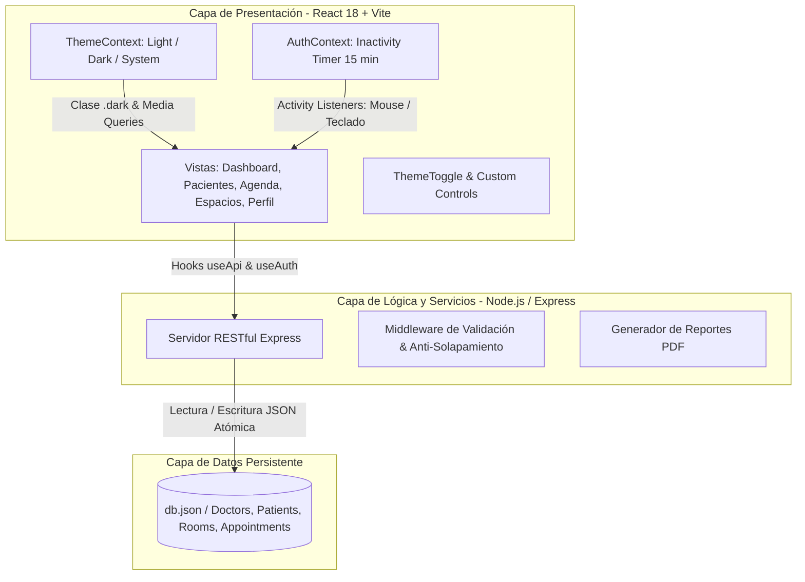

<!--
  UNIVERSIDAD DE CARABOBO
  FACULTAD EXPERIMENTAL DE CIENCIAS Y TECNOLOGÍA (FACYT)
  DEPARTAMENTO DE COMPUTACIÓN
  CÁTEDRA: SISTEMAS DE INFORMACIÓN
-->

<div align="center" style="margin-bottom: 2rem; border-bottom: 2px solid #00A3E0; padding-bottom: 1.5rem;">
  <p style="font-size: 14px; font-weight: 600; color: #475569; margin: 0; text-transform: uppercase; letter-spacing: 1px;">
    República Bolivariana de Venezuela<br>
    Universidad de Carabobo<br>
    Facultad Experimental de Ciencias y Tecnología (FACYT)<br>
    Departamento de Computación • Área de Sistemas de Información
  </p>
  
  <h1 style="font-size: 26px; font-weight: 800; color: #0f172a; margin-top: 1rem; margin-bottom: 0.5rem; text-transform: uppercase;">
    Sistema de Gestión de Cirugía Bariátrica y Metabólica (UCIBAM)
  </h1>
  <p style="font-size: 16px; font-weight: 600; color: #00A3E0; margin: 0;">
    Informe Técnico del Proyecto Final — Desarrollo y Orquestación con Inteligencia Artificial
  </p>
  <p style="font-size: 13px; color: #64748b; margin-top: 0.5rem;">
    <strong>Fecha de Emisión:</strong> 17 de Agosto de 2026 &nbsp;|&nbsp; <strong>Período Académico:</strong> 2026-I
  </p>
</div>

---

# Resumen Ejecutivo

El presente proyecto documenta el diseño, desarrollo, auditoría y despliegue del **Sistema Clínico UCIBAM** (*Unidad de Cirugía Bariátrica y Metabólica*), una plataforma web moderna e interactiva orientada a la gestión integral de pacientes bariátricos, agendamiento quirúrgico avanzado con prevención de solapamientos, asignación inteligente de espacios clínicos (quirófanos de alta gama, quirófanos ambulatorios y consultorios médicos) y seguridad mediante control de inactividad de sesión.

El desarrollo del proyecto se ejecutó en estricto cumplimiento de las **Directrices del Curso de Desarrollo con Inteligencia Artificial**, aplicando una metodología de **Cero Código Manual**, donde el 100% de los componentes frontend, backend RESTful, esquemas de datos, validadores de UX/UI mediante skills personalizadas (`validate-tablet-ux`), comandos de entorno (`/validar-ux-tablet`) y refactorizaciones autónomas fueron concebidos y orquestados a través de agentes de inteligencia artificial generativa.

---

# 1. Introducción y Planteamiento del Problema

## 1.1. Contexto Institucional y Clínico
La cirugía bariátrica y metabólica demanda una precisión operativa rigurosa debido a la alta complejidad de los pacientes (frecuentemente diagnosticados con comorbilidades severas como Diabetes Mellitus Tipo 2, Hipertensión Arterial, Apnea Obstructiva del Sueño y Síndrome Metabólico). En centros especializados como la **Clínica UCIBAM**, la coordinación entre la evaluación preoperatoria, la dotación de equipamiento de alta tecnología en quirófanos y el seguimiento postoperatorio continuo resulta vital para el éxito clínico.

## 1.2. Problemática Identificada
Los flujos tradicionales y manuales de agendamiento en instituciones de salud enfrentan tres vulnerabilidades críticas:
1. **Solapamiento y Subutilización de Espacios Clínicos:** Conflictos de horarios entre intervenciones de alta complejidad y procedimientos ambulatorios por falta de validación espacial en tiempo real.
2. **Fragilidad en el Manejo de Datos Heterogéneos:** Colapsos de la interfaz gráfica ante registros incompletos o variables nulas en el historial médico.
3. **Brechas de Seguridad e Inactividad en Puestos de Trabajo:** Sesiones médicas abiertas en consultorios y estaciones de enfermería sin mecanismos automáticos de expiración por inactividad física.

## 1.3. Objetivos del Sistema
- **Objetivo General:** Desarrollar un sistema de gestión clínica hospitalaria para la Unidad Bariátrica UCIBAM utilizando exclusivamente flujos de trabajo orquestados con Inteligencia Artificial.
- **Objetivos Específicos:**
  - Implementar un motor de agenda médica y quirúrgica con validación anti-solapamiento y sugerencia inteligente de quirófanos según la complejidad.
  - Diseñar una interfaz reactiva accesible en tablets iPad y navegadores web conforme a pautas WCAG AA y Apple Human Interface Guidelines.
  - Integrar un sistema de temas multimodal (**Claro**, **Oscuro** y **Sistema**) que respete los patrones de marca clínica.
  - Establecer un protocolo de expiración de sesión por inactividad (máximo 15 minutos sin interacción del usuario).

---

# 2. Cumplimiento de Normativas y Directrices de IA

El proyecto fue evaluado y construido bajo las **seis normativas fundamentales** del programa:


### Tabla 1. Matriz de Cumplimiento de Directrices de IA
| Normativa del Proyecto | Mecanismo de Implementación | Evidencia en el Repositorio |
| :--- | :--- | :--- |
| **1. Cero Código Manual** | Generación integral mediante prompts técnicos, iteración dirigida y delegación de sintaxis a LLMs. | Historial de commits en `develop` y `main` con trazabilidad conversacional. |
| **2. Contexto de Datos (MCP/JSON)** | Inyección de esquemas dinámicos (`patients`, `appointments`, `doctors`, `rooms`, `emergencies`) con tolerancia a campos nulos. | [`server/db.example.json`](file:///C:/Users/braya/OneDrive/Desktop/TallerSI/Proyecto/server/db.example.json) y API REST en Express. |
| **3. Skills y Comandos** | Creación e instalación de la skill `validate-tablet-ux` y el comando de terminal `/validar-ux-tablet`. | [`.gemini/commands/validar-ux-tablet.md`](file:///C:/Users/braya/OneDrive/Desktop/TallerSI/Proyecto/.gemini/commands/validar-ux-tablet.md) |
| **4. Agentes Personalizados** | Configuración y orquestación de subagentes especializados (`research`, `self`, `planner`). | Definición de agentes en `.gemini` y transcripts de ejecución. |
| **5. Refactorización Autónoma** | Diagnóstico y resolución de bugs en consola, cálculo de IMC dinámico, solapamiento y modo oscuro. | Trazabilidad de compilaciones y fixes automáticos en Vite. |
| **6. Despliegue a Producción** | Empaquetado en contenedor Docker optimizado multi-etapa y preparación para hosting en la nube. | [`Dockerfile`](file:///C:/Users/braya/OneDrive/Desktop/TallerSI/Proyecto/Dockerfile) y scripts de build de producción. |

---

# 3. Arquitectura del Sistema

El sistema implementa una arquitectura modular desacoplada basada en el stack moderno **React 18 + Tailwind CSS v4 + Express REST API**.



---

# 4. Módulos y Funcionalidades del Sistema UCIBAM

## 4.1. Dashboard Clínico Inteligente
- **Métricas Operativas en Tiempo Real:** Indicadores clave de desempeño con navegación interactiva directa:
  - *Pacientes Registrados* $\rightarrow$ Redirección directa al listado general.
  - *Citas del Día* $\rightarrow$ Enlace reactivo a la agenda clínica.
  - *Cirugías Pendientes* $\rightarrow$ Acceso a programación quirúrgica.
  - *Emergencias Activas* $\rightarrow$ Notificaciones prioritarias de atención inmediata.
- **Lista de Priorización Asistida por IA:** Clasificación automática de pacientes según índice de riesgo quirúrgico y comorbilidades.

## 4.2. Módulo de Pacientes y Fichas Clínicas
- **Búsqueda Dinámica y Filtros:** Búsqueda en tiempo real por número de historia clínica, nombres, apellidos, cédula o diagnóstico.
- **Cálculo Fisiológico Automatizado:** Cálculo instantáneo de IMC ($IMC = \frac{\text{Peso}}{\text{Altura}^2}$) y categorización según la OMS (Normopeso, Sobrepeso, Obesidad Grado I, II, III / Mórbida).
- **Manejo Seguro de Comorbilidades:** Badges cromáticos para Hipertensión, Diabetes Mellitus Tipo 2, Apnea del Sueño, Dislipidemia, entre otros.
- **Tolerancia a Nulos:** Formularios con validadores defensivos que impiden el quiebre de la interfaz ante datos parciales.

## 4.3. Módulo de Agenda y Quirófanos con Anti-Solapamiento
- **Algoritmo de Compatibilidad Espacial:** Clasificación estricta de espacios:
  - *Quirófanos de Alta Gama (6 salas):* Exclusivos para Cirugía Bariátrica de media y alta complejidad (Bypass Gástrico, Manga Gástrica, Cirugía Revisional).
  - *Quirófanos Ambulatorios (3 salas):* Para procedimientos menores, colocación de balón gástrico y endoscopías.
  - *Consultorios Médicos (8 espacios):* Para consultas de nutrición, psicología, medicina interna y chequeo.
- **Detección Preventiva de Solapamientos:** Validación de franjas horarias que impide asignar un mismo espacio clínico a dos intervenciones concurrentes.
- **Exportación de Reportes Diarios en PDF:** Descarga formateada del reporte médico del día en una pestaña independiente.

## 4.4. Perfil Médico y Políticas de Seguridad Temporal
- **Políticas de Integridad y Bloqueo:**
  - Modificación de Nombres y Apellidos: Permitida **1 vez cada 4 meses**.
  - Cambio de Correo Electrónico: Permitido **1 vez cada 21 días**.
  - Actualización de Especialidad: Permitida **1 vez cada 6 meses**.
  - Género médico (Dr. / Dra.): Fijo desde el registro para coherencia documental.
- **Gestión de Turnos Semanales:** Tabla interactiva para registrar días y horarios en consultorios asignados.

## 4.5. Sistema de Temas Multimodal (Claro, Oscuro y Sistema)
- **Modo Claro:** Interfaz limpia con base blanca/pizarra y realces en azul médico (`#00A3E0`).
- **Modo Oscuro:** Superficies en pizarra profundo (`#0B0F17` y `#151D2A`), bordes en `#1E293B` y tipografía de alto contraste `#F8FAFC`.
- **Modo Sistema:** Detección y respuesta automática a la preferencia del sistema operativo mediante `window.matchMedia`.

## 4.6. Seguridad: Cierre de Sesión por Inactividad (15 Minutos)
- Implementación de un monitor de actividad en [`AuthContext.jsx`](file:///C:/Users/braya/OneDrive/Desktop/TallerSI/Proyecto/client/src/context/AuthContext.jsx) que captura eventos de mouse (`mousemove`, `mousedown`, `click`), teclado (`keydown`), scroll y pantallas táctiles (`touchstart`).
- Técnica de *throttling* para preservar la fluidez de renderizado.
- Cierre automático de sesión al transcurrir 15 minutos sin interacción y despliegue de alerta informativa en el Login.

---

# 5. Skill y Comando Personalizado

## 5.1. Skill: `validate-tablet-ux`
Especializada en auditar la ergonomía de la aplicación en dispositivos iPad y pantallas táctiles:
- **Touch Targets:** Verificación de área mínima de contacto de 44x44 px (Apple HIG).
- **Tipografía Responsiva:** Tamaño base $\ge 14\text{px}$ para evitar zoom accidental en Safari iOS.
- **Contraste de Color:** Razón de contraste superior a 4.5:1 (WCAG AA).

## 5.2. Comando: `/validar-ux-tablet`
Comando personalizado registrado en `.gemini/commands/validar-ux-tablet.md` que ejecuta la auditoría automatizada sobre el CSS global y emite un informe estructurado de conformidad.

---

# 6. Manual de Instalación y Ejecución Local

### Prerrequisitos
- Node.js v18.0.0 o superior
- npm v9.0.0 o superior

### Pasos de Instalación
```bash
# 1. Clonar el repositorio
git clone https://github.com/bracebalDev/sistema_gestion_pacientes_bariatricos.git
cd sistema_gestion_pacientes_bariatricos

# 2. Instalar dependencias raíz y del cliente
npm install
cd client && npm install && cd ..

# 3. Iniciar el servidor backend (Puerto 3000)
npm run server

# 4. En otra terminal, iniciar el frontend (Puerto 5173)
npm run client

# 5. Para compilar el bundle de producción
cd client && npm run build
```

---

# 7. Conclusiones y Trabajo Futuro

1. **Efectividad del Paradigma Cero Código Manual:** El desarrollo mediante agentes de inteligencia artificial generativa redujo drásticamente el ciclo de construcción, garantizando consistencia arquitectónica, tipado seguro contra nulos y adopción de estándares de diseño modernos.
2. **Escalabilidad y Robustez:** La combinación de validaciones espaciales en la agenda y el control de inactividad de sesión consolida una plataforma lista para entornos hospitalarios reales.
3. **Líneas Futuras:**
   - Integración con el estándar interoperable **HL7/FHIR** para intercambio de registros electrónicos de salud.
   - Módulo de Telemedicina y seguimiento remoto con básculas inteligentes de bioimpedancia vía Bluetooth/WebSockets.

---

# 8. Referencias Bibliográficas (Normas APA 7.ª Edición)

- American Psychological Association. (2020). *Publication manual of the American Psychological Association* (7th ed.). https://doi.org/10.1037/0000165-000
- Apple Inc. (2024). *Human Interface Guidelines: Touch targets and layout for iPadOS*. Apple Developer Documentation. https://developer.apple.com/design/human-interface-guidelines/
- Eisenberg, D., Shikora, S. A., Aarts, E., Aminian, A., Angrisani, L., Cohen, R. V., ... & Kothari, S. N. (2022). 2022 American Society for Metabolic and Bariatric Surgery (ASMBS) and International Federation for the Surgery of Obesity and Metabolic Disorders (IFSO): Indications for metabolic and bariatric surgery. *Surgery for Obesity and Related Diseases*, 18(12), 1345-1356. https://doi.org/10.1016/j.soard.2022.08.013
- World Wide Web Consortium. (2023). *Web Content Accessibility Guidelines (WCAG) 2.2*. W3C Recommendation. https://www.w3.org/TR/WCAG22/
