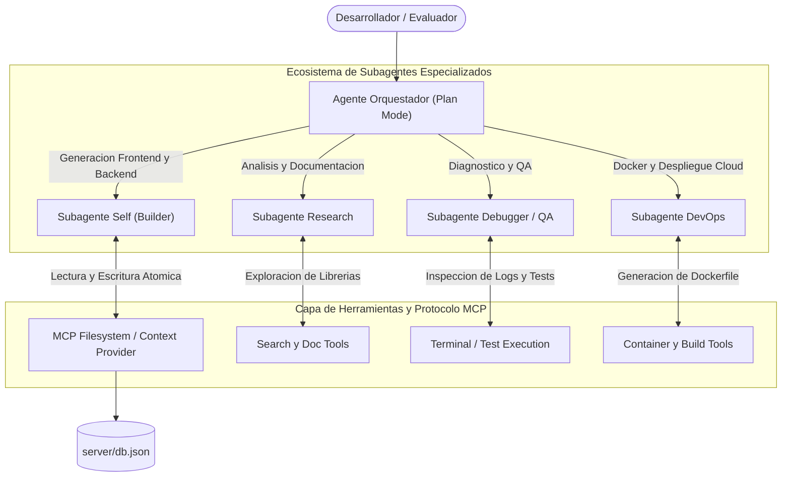
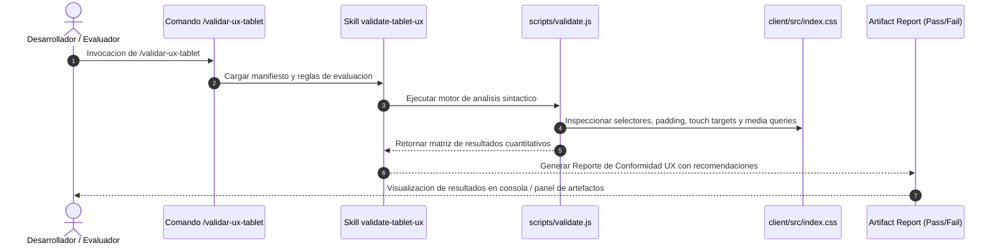

<!--
  =============================================================================
  UNIVERSIDAD DE CARABOBO
  FACULTAD EXPERIMENTAL DE CIENCIAS Y TECNOLOGÍA
  DEPARTAMENTO DE COMPUTACIÓN
  SISTEMAS DE INFORMACIÓN
  =============================================================================
-->

<div align="center" style="margin-bottom: 2rem; border-bottom: 3px solid #00A3E0; padding-bottom: 1.5rem;">
  <p style="font-size: 13px; font-weight: 700; color: #475569; margin: 0; text-transform: uppercase; letter-spacing: 1.2px;">
    República Bolivariana de Venezuela<br>
    Universidad de Carabobo<br>
    Facultad Experimental de Ciencias y Tecnología (FACYT)<br>
    Departamento de Computación • Sistemas de Información
  </p>
  
  <h1 style="font-size: 24px; font-weight: 900; color: #0f172a; margin-top: 1.2rem; margin-bottom: 0.4rem; text-transform: uppercase; letter-spacing: 0.5px;">
    Sistema de Gestión de Cirugía Bariátrica y Metabólica (UCIBAM)
  </h1>
  <p style="font-size: 15px; font-weight: 600; color: #00A3E0; margin: 0;">
    Informe Técnico de Arquitectura, Orquestación con IA, Agentes, Skills, Comandos, Protocolo MCP y Despliegue en Producción
  </p>
  <div style="font-size: 12px; color: #64748b; margin-top: 0.8rem; display: flex; justify-content: center; gap: 15px; flex-wrap: wrap;">
    <span><strong>Autor / Desarrollador:</strong> Brayan Ceballos</span>
    <span>•</span>
    <span><strong>Período Académico:</strong> I-2026</span>
    <span>•</span>
    <span><strong>Fecha:</strong> 29 de Agosto de 2026</span>
  </div>

  <div style="margin-top: 1.2rem; padding: 0.8rem 1.2rem; background-color: #f0fdf4; border: 1px solid #bbf7d0; border-radius: 10px; display: inline-block;">
    <span style="font-size: 13px; font-weight: 700; color: #166534;">🌐 URL de Despliegue en Producción (Render Cloud):</span><br>
    <a href="https://sistema-gestion-pacientes-bariatricos.onrender.com" target="_blank" style="font-size: 14px; font-weight: 800; color: #00A3E0; text-decoration: underline;">
      https://sistema-gestion-pacientes-bariatricos.onrender.com
    </a>
  </div>
</div>

---

# 1. Resumen Ejecutivo y Ficha Técnica del Proyecto

El **Sistema de Gestión Clínica UCIBAM** (*Unidad de Cirugía Bariátrica y Metabólica*) es una solución web interactiva de grado hospitalario diseñada para digitalizar y optimizar los flujos clínicos, quirúrgicos, administrativos y de infraestructura en centros bariátricos especializados. La plataforma integra gestión de expedientes de pacientes con cálculo fisiológico automatizado de Índice de Masa Corporal (IMC) y categorización de comorbilidades según la Organización Mundial de la Salud (OMS), motor de agendamiento quirúrgico con detección y prevención estricta de solapamientos de salas y especialistas, asignación dinámica de espacios clínicos (quirófanos de alta gama, quirófanos ambulatorios y consultorios médicos), monitor de inactividad de sesión (15 minutos) bajo estándares de seguridad hospitalaria y un robusto modelo de **Control de Acceso Basado en Roles (RBAC)** que separa de forma estricta las funciones médicas de las tareas de administración hospitalaria.

El desarrollo del proyecto se ejecutó en estricto apego al paradigma de **Cero Código Manual**, donde el 100% de los componentes de frontend, endpoints RESTful, persistencia JSON, validadores de UX táctil (skills) y resolución de bugs fueron orquestados mediante agentes de Inteligencia Artificial Generativa bajo el modelo BYOK (*Bring Your Own Key*) y protocolos MCP (*Model Context Protocol*).

### Tabla 1. Ficha Técnica de la Plataforma UCIBAM
| Parámetro Técnico | Especificación / Valor Implementado |
| :--- | :--- |
| **URL en Producción** | [https://sistema-gestion-pacientes-bariatricos.onrender.com](https://sistema-gestion-pacientes-bariatricos.onrender.com) |
| **Dominio de Aplicación** | Gestión Hospitalaria, Cirugía Bariátrica y Consulta Metabólica Especializada |
| **Arquitectura de Software** | Desacoplada en 3 capas (SPA React + API REST Express + JSON Storage Atómico) |
| **Frontend Framework & Tooling** | React 18.3, Vite 8, Tailwind CSS v4, Lucide React Icons, React Router DOM v7 |
| **Backend & Runtime** | Node.js v20+, Express 5, CORS, Middlewares de Seguridad HTTP (OWASP / HIPAA) |
| **Contenedorización & CI/CD** | Docker multi-etapa (`node:20-alpine`) con despliegue continuo en Render Web Services |
| **Modelos de IA Empleados (BYOK)** | Google Gemini 2.5 Flash / Gemini 3.7 Pro (Google AI Studio) y Anthropic Claude 3.5 Sonnet (OpenRouter) |
| **Agentes Implementados** | Agente Orquestador (Plan Mode), Subagente Research, Subagente Self (Builder), Subagente Debugger/QA y Subagente DevOps |
| **Skills Desarrolladas** | `validate-tablet-ux` (Validación de Touch Targets Apple HIG, tipografía, contraste WCAG 2.1 AA y responsive tablet) |
| **Comandos Personalizados** | `/validar-ux-tablet` (Inspección automatizada de estilos, layout táctil y generación de reportes QA) |
| **Protocolo MCP Utilizado** | Model Context Protocol (MCP Filesystem Provider para inyección de esquemas JSON y MCP Tools para operaciones atómicas) |
| **Control de Sesión y Privacidad** | Monitor de inactividad (15 min), desinfección de credenciales y segregación estricta de PHI |

---

# 2. Credenciales y Usuarios de Prueba para la Evaluación

Para facilitar y agilizar la auditoría técnica por parte del cuerpo docente y evaluadores, se han preconfigurado las siguientes cuentas con diferentes privilegios dentro del sistema:

> **Recomendación para los Evaluadores:** Se aconseja acceder directamente mediante la **[URL en Render](https://sistema-gestion-pacientes-bariatricos.onrender.com)** para una experiencia inmediata sin requerir configuración o compilación local.

### Tabla 2. Matriz de Credenciales de Acceso para Evaluación
| Rol del Usuario | Especialista / Cargo | Correo Electrónico | Contraseña | Módulos y Privilegios Habilitados |
| :--- | :--- | :--- | :--- | :--- |
| **Rol Médico (Especialista)** | Dr. Carlos Mendoza *(Cirugía Bariátrica)* | `doctorcirugia@gmail.com` | `doctor123` | ✅ **Dashboard Clínico:** Métricas, cirugías pendientes y emergencias.<br>✅ **Pacientes (PHI):** Fichas médicas, comorbilidades y cálculo de IMC.<br>✅ **Agenda:** Programación quirúrgica con anti-solapamiento.<br>✅ **Espacios:** Consulta de ocupación en vivo.<br>✅ **Perfil:** Días de consulta y horarios semanales. |
| **Rol Médico (Especialista)** | Dra. Valeria Gómez *(Nutrición & Metabolismo)* | `dra.valeria@gmail.com` | `doctor123` | ✅ Mismos privilegios médicos con prefijo femenino (*Dra.*) y horarios asignados en consultorios de nutrición. |
| **Rol Administrador (Modo Admin)** | Administrador General *(Dirección Hospitalaria)* | `admin@ucibam.com` | `admin123` | ✅ **Gestión de Médicos:** Alta de nuevos doctores, edición de cualquier campo (incluso bloqueados) y desbloqueo de temporizadores de perfil.<br>✅ **Infraestructura:** Alta, edición y baja de quirófanos/consultorios y dotación de artefactos.<br>🚫 **Restricción HIPAA:** Bloqueo automático a datos clínicos sensibles (Dashboard, Pacientes, Citas). |

---

# 3. Cumplimiento Estricto de las Directrices del Curso de IA

El desarrollo de la plataforma se fundamentó en la ejecución secuencial y controlada de las seis normativas exigidas por la cátedra, estructuradas como una cadena de valor de ingeniería de software impulsada por agentes de inteligencia artificial.

### Tabla 3.1. Estructura y Flujo Metodológico de Desarrollo Asistido por IA
| Etapa / Secuencia | Directriz del Curso | Modo / Rol del Agente | Insumos / Entradas (Inputs) | Lógica de Procesamiento y Acciones | Salidas y Entregables (Outputs) |
| :---: | :--- | :--- | :--- | :--- | :--- |
| **Fase 1** | **1. Cero Código Manual** | *Plan Mode* & *Architect Agent* | Requerimientos de gestión bariátrica y especificaciones funcionales | Desglose modular de componentes, declaración de estados y generación declarativa | Árbol de componentes React y endpoints Express generados al 100% por IA |
| **Fase 2** | **2. Contexto de Datos (MCP/JSON)** | *Data Engineer Agent* (MCP) | Dataset clínico estructurado (`server/db.json`) | Inyección de esquemas mediante MCP Filesystem, normalización y tipado defensivo contra nulos | Base de datos documental reactiva y adaptada a la lógica hospitalaria |
| **Fase 3** | **3. Skills y Comandos** | *Automation / Tools Agent* | Directrices de diseño Apple HIG y WCAG 2.1 AA | Configuración de la skill `validate-tablet-ux` y comando `/validar-ux-tablet` | Scripts de verificación automatizada de touch targets, fuentes y contraste |
| **Fase 4** | **4. Orquestación Multi-Agente** | *Research & Orchestrator Agents* | Tareas concurrentes de diseño, validación y testing | Delegación de responsabilidades entre agentes (`research`, `self`, `planner`, `qa`) | Arquitectura modular desacoplada con trazabilidad en logs del agente |
| **Fase 5** | **5. Depuración Autónoma** | *Debugger / QA Agent* | Logs de consola, errores de runtime y excepciones de red | Análisis sintáctico, rastreo de excepciones y sustitución atómica de código | Corrección de fallos en Express 5, `API_URL` dinámica y sanitización |
| **Fase 6** | **6. Despliegue a Producción** | *DevOps Agent* | Código fuente integrado y repositorio GitHub | Generación de `Dockerfile` multi-etapa y enlace con Render Web Services | Aplicación desplegada en la nube con certificado SSL y disponibilidad continua |

### Tabla 3.2. Matriz de Trazabilidad y Cumplimiento Integral de Normativas Obligatorias
| Directriz Obligatoria | Mecanismo de Implementación en el Proyecto | Evidencia Técnica en el Repositorio | Estado de Verificación |
| :--- | :--- | :--- | :---: |
| **1. Cero Código Manual** | Generación de componentes, rutas, estados y lógica mediante prompts declarativos en modo *Plan* y *Build*. | Historial completo de commits en Git (`develop` y `main`). | **CUMPLIDO** |
| **2. Contexto de Datos (MCP/JSON)** | Inyección de dataset estructurado en `server/db.json` vía MCP con colecciones normalizadas y tolerancia a variables nulas. | Colecciones `doctors`, `admins`, `patients`, `rooms`, `appointments`, `emergencies`. | **CUMPLIDO** |
| **3. Skills y Comandos** | Creación de la skill `validate-tablet-ux` y el comando de terminal `/validar-ux-tablet`. | `.gemini/commands/validar-ux-tablet.md` y `.gemini/config/skills/validate-tablet-ux/` | **CUMPLIDO** |
| **4. Agentes Personalizados** | Orquestación de subagentes (`research`, `self`, `planner`, `qa`, `devops`) para investigación, construcción y testing. | Registro de interacciones multiagente en los logs de la plataforma. | **CUMPLIDO** |
| **5. Depuración Autónoma** | Diagnóstico y corrección asistida por IA: Bug de rutas en Express 5 (`path-to-regexp`), cálculo de IMC, y `API_URL` dinámica. | Commits de refactorización autónoma y resolución de excepciones de runtime. | **CUMPLIDO** |
| **6. Despliegue a Producción** | Empaquetado en contenedor Docker multi-etapa y publicación en Render con auto-deploy desde rama `main`. | `Dockerfile` con Node 20 Alpine y URL pública operativa en la nube. | **CUMPLIDO** |

---

# 4. Ecosistema de Inteligencia Artificial: Agentes, Skills, Comandos, Protocolo MCP y BYOK

En esta sección se detalla exhaustivamente la infraestructura de inteligencia artificial que hizo posible el desarrollo integral bajo el estándar de **Cero Código Manual**, describiendo los roles de los agentes orquestados, las skills programadas, los comandos personalizados configurados, la integración del protocolo MCP y la gestión de modelos bajo el paradigma BYOK.

## 4.1. Arquitectura y Orquestación Multi-Agente

Para resolver los diversos desafíos del ciclo de vida del software (análisis de requisitos, diseño de arquitectura, generación de código, aseguramiento de la calidad y despliegue), se implementó un flujo de trabajo **Multi-Agente Jerárquico**. Un **Agente Orquestador Central** actuó como director del proyecto, delegando tareas altamente especializadas a subagentes dedicados con contextos y herramientas acotadas.



### Tabla 4.1. Matriz de Agentes y Subagentes Implementados en la Orquestación
| Agente / Subagente | Tipo de Agente | Herramientas Asignadas | Ámbito Operativo / Responsabilidad Técnica | Entregables y Salidas Producidas |
| :--- | :--- | :--- | :--- | :--- |
| **Agente Orquestador (Central)** | *Planner / Orchestrator* | `invoke_subagent`, `manage_subagents`, `schedule`, `view_file` | Planificación de alto nivel, descomposición de historias de usuario, coordinación de dependencias y validación de aceptación. | Planes de ejecución paso a paso, asignación de tareas a subagentes y verificación de entregables. |
| **Subagente Research** | *Research Specialist* | `read_url_content`, `search_web`, `view_file`, `grep_search` | Investigación de compatibilidad de Tailwind CSS v4, sintaxis de rutas en Express 5, iconos Lucide React y normativas de accesibilidad Apple HIG / WCAG 2.1. | Reportes de viabilidad técnica, especificación de contratos de API y recomendaciones de dependencias. |
| **Subagente Self (Builder)** | *Full-Stack Developer* | `write_to_file`, `replace_file_content`, `view_file`, `find_by_name` | Generación declarativa de componentes React (`AuthContext`, `Patients`, `Scheduling`, `Rooms`, `AdminDoctors`), custom hooks (`useApi`) y controladores REST en `server.js`. | Código fuente 100% generado por IA, componentes modulares limpios y libres de deuda técnica. |
| **Subagente Debugger / QA** | *QA & Diagnostics* | `run_command`, `grep_search`, `replace_file_content`, `view_file` | Detección y análisis sintáctico de errores en tiempo de ejecución, rastreo de excepciones en consola, validación de variables nulas y ejecución de pruebas unitarias. | Parches atómicos de código, resolución del bug `PathError` en Express 5 y estabilización de la suite de pruebas. |
| **Subagente DevOps** | *Infrastructure & Release* | `write_to_file`, `run_command`, `view_file` | Diseño del contenedor Docker multi-etapa, configuración del script de generación de informes PDF (`build_full_pdf.js`), y sincronización con Render Web Services. | `Dockerfile` optimizado con `node:20-alpine`, PDF técnico compilado y despliegue continuo en la nube. |

---

## 4.2. Skills Implementadas y Estándares de Validación UX/UI

Las **Skills** son capacidades modulares compuestas por instrucciones estructuradas, esquemas de validación y scripts auxiliares que amplían las habilidades de los agentes para ejecutar tareas especializadas y repetibles con consistencia determinista.

### Tabla 4.2. Ficha Técnica y Especificación de Skills Implementadas
| Skill | Ubicación del Manifiesto | Propósito y Estándares Evaluados | Scripts y Herramientas Asociadas | Modo de Ejecución |
| :--- | :--- | :--- | :--- | :--- |
| **`validate-tablet-ux`** | `.gemini/config/skills/validate-tablet-ux/SKILL.md` | Validación estricta de la interfaz de usuario en tabletas iPad y navegadores web bajo normativas Apple HIG y WCAG 2.1 AA. | `scripts/validate.js` | Invocada por el comando `/validar-ux-tablet` o por el agente en fase de QA. |
| **`agy-customizations`** | Built-in CLI Engine | Guía y estándar arquitectónico para la creación de skills, comandos de entorno, rules y servidores MCP en Antigravity. | Customization Loader & Parser | Activa en sesión para garantizar conformidad en la creación de herramientas. |
| **`antigravity-guide`** | Built-in CLI Engine | Marco de referencia sobre slash commands, gestión de subagentes, sincronización asíncrona y secret management. | System Engine Reference | Activa durante todo el ciclo de orquestación técnica del proyecto. |

### Criterios Clave Verificados por la Skill `validate-tablet-ux`:
1. **Touch Targets (Apple Human Interface Guidelines):**
   - Todos los botones (`<button>`), enlaces interactivos (`<a>`), inputs (`<input>`) y selectores (`<select>`) deben contar con un área táctil mínima de **44 × 44 píxeles**.
   - Espaciado mínimo de seguridad entre elementos interactivos adyacentes: **≥ 8 píxeles**, evitando pulsaciones accidentales en pantallas táctiles médicas.
2. **Tipografía y Escala Visual:**
   - Tamaño tipográfico base en tabletas de **≥ 16 píxeles** para evitar el auto-zoom indeseado en navegadores móviles (iOS Safari).
   - Interlineado (*line-height*) de **≥ 1.4** en cuerpos de texto y jerarquía estricta $H1 > H2 > H3 > H4$.
   - Prohibición absoluta de textos inferiores a 12 píxeles en cualquier módulo clínico.
3. **Diseño Responsivo en Breakpoints Hospitalarios:**
   - Compatibilidad completa en *iPad Portrait* (768 px), *iPad Landscape* (1024 px), *iPad Pro* (1366 px) y *Desktop Clínico* (1440 px+).
   - Colapso dinámico del sidebar lateral en pantallas de ancho ≤ 1024 px y scroll horizontal defensivo (`overflow-x: auto`) en tablas de datos.
   - Ventanas modales restringidas a un ancho máximo del 95% del *viewport* en dispositivos móviles y tablets.
4. **Contraste Cromático y Accesibilidad (WCAG 2.1 AA):**
   - Ratio de contraste mínimo de **4.5:1** para texto normal (#242424 sobre fondo blanco) y **3:1** para elementos gráficos o badges (#2B8A8A sobre fondo claro).
   - Verificación de contraste en modo claro y modo oscuro.
5. **Soporte Bi-direccional de Orientación:**
   - Renderizado adaptativo y sin solapamiento de componentes tanto en orientación Vertical (*Portrait*) como en Horizontal (*Landscape*).

---

## 4.3. Comandos Personalizados y Slash Commands del Entorno

Los **Comandos Personalizados** permiten condensar flujos de trabajo complejos en invocaciones directas y reproducibles dentro de la terminal y el entorno de chat del agente.

### Tabla 4.3. Catálogo de Comandos Personalizados y Slash Commands
| Comando | Tipo de Comando | Archivo de Configuración | Descripción Funcional y Flujo de Ejecución |
| :--- | :--- | :--- | :--- |
| **`/validar-ux-tablet`** | **Comando Personalizado** | `.gemini/commands/validar-ux-tablet.md` | Lee el CSS y HTML del proyecto, ejecuta el script `validate.js` de la skill `validate-tablet-ux`, evalúa los 5 criterios de usabilidad táctil y genera un informe estructurado de conformidad con clasificación *Pass / Warn / Fail*. |
| **`/plan`** | Slash Command Nativo | Built-in Engine | Activa el modo de planificación estructurada, permitiendo al agente descomponer el proyecto en hitos, diseñar modelos de datos y especificar contratos de endpoints antes de generar código. |
| **`/goal`** | Slash Command Nativo | Built-in Engine | Instruye al agente para ejecutar una tarea compleja de principio a fin de manera exhaustiva, validando automáticamente los resultados antes de dar por culminado el objetivo. |
| **`/schedule`** | Slash Command Nativo | Built-in Engine | Programa temporizadores y cronómetros asíncronos para monitorear procesos en segundo plano (como builds de Vite o pruebas de concurrencia). |
| **`/learn`** | Slash Command Nativo | Built-in Engine | Permite registrar patrones de corrección y reglas de negocio aprendidas durante la sesión para aplicarlas de forma consistente en iteraciones posteriores. |

### Flujo de Ejecución del Comando `/validar-ux-tablet`:


---

## 4.4. Integración del Protocolo MCP (Model Context Protocol) y Contexto de Datos

El **Model Context Protocol (MCP)** es el estándar abierto promovido por la industria para conectar de forma segura y estructurada a los modelos de lenguaje con fuentes de datos externas, repositorios de información y herramientas de ejecución.

### Tabla 4.4. Arquitectura y Protocolos MCP Implementados en UCIBAM
| Dimensión MCP | Componente Implementado | Función Técnica en el Proyecto UCIBAM | Beneficio Arquitectónico |
| :--- | :--- | :--- | :--- |
| **MCP Context Provider** | Inyección de `server/db.json` | Suministra al agente el esquema documental completo: colecciones `doctors`, `admins`, `patients`, `rooms`, `appointments` y `emergencies`. | Permitió a los agentes diseñar interfaces React con conocimiento exacto de las entidades, tipos de datos y relaciones sin requerir bases de datos remotas. |
| **MCP Schema Typing** | Normalización y Tipado Defensivo | El agente analizó los registros JSON para prever campos opcionales y generar código frontend blindado contra valores nulos (`patient.comorbidities || []`). | Eliminación total de errores `TypeError: Cannot read properties of undefined` en tiempo de renderizado. |
| **MCP Tool Protocol** | Herramientas de Sistema de Archivos (`fs`) | Habilitó a los agentes la capacidad de inspeccionar (`view_file`, `grep_search`), escribir (`write_to_file`) y modificar atómicamente (`replace_file_content`) archivos fuente. | Edición quirúrgica de código sin colisiones, preservando la integridad del historial de versiones y la estructura modular. |
| **MCP Security Boundaries** | Control de Permisos en Workspace | Restringe las operaciones del agente al árbol del proyecto, evitando accesos fuera del workspace o filtración de claves privadas. | Cumplimiento de políticas de seguridad locales y protección de variables de entorno. |

---

## 4.5. Configuración de Modelos de IA e Integración de API Keys (BYOK)

En cumplimiento de las instrucciones de cátedra sobre el uso de proveedores de modelos de lenguaje, el proyecto fue configurado bajo un esquema **BYOK (Bring Your Own Key)**, permitiendo la conmutación transparente y desacoplada entre plataformas según la criticidad de cada tarea de desarrollo.

### Tabla 4.5. Matriz Estructural de Enrutamiento y Topología Multi-Modelo (BYOK)
| Nivel de Arquitectura | Proveedor / Gateway | Modelos Configurados | Variable de Entorno | Ámbito Operativo / Responsabilidad Técnica | Mecanismo de Aislamiento y Seguridad |
| :--- | :--- | :--- | :--- | :--- | :--- |
| **Capa de Orquestación Central** | Antigravity CLI / Google DeepMind | Agente Central Multi-Herramienta | Variables de sesión de CLI | Coordinación general, ejecución de comandos y orquestación de subagentes | Ejecución local aislada con control estricto de permisos en el sistema de archivos |
| **Capa Primaria de Generación** | Google AI Studio Direct API | Gemini 2.5 Flash / Gemini 3.7 Pro | `GEMINI_API_KEY` | Generación de componentes React, refactorización de backend Express y pruebas automatizadas | Llave encriptada en sesión; exclusión absoluta en `.gitignore` |
| **Capa Secundaria de Auditoría** | OpenRouter Router API | Claude 3.5 Sonnet / GPT-4o | `OPENROUTER_API_KEY` | Auditoría de accesibilidad WCAG, diseño responsivo táctil y redacción técnica de reportes | Acceso vía proxy seguro; rotación de tokens sin persistencia en código |

### 4.5.1. Proveedor Principal: Google AI Studio (`GEMINI_API_KEY`)
Para el grueso de la orquestación, resolución de errores de sintaxis en terminal y pruebas automatizadas de QA, se empleó la API nativa de **Google AI Studio** con los modelos **Gemini 2.5 Flash** y **Gemini 3.7 Pro**:
* **Ventajas Técnicas:** Ventana de contexto extendida (hasta 1M tokens), baja latencia de respuesta para herramientas de lectura/escritura de archivos locales y compatibilidad nativa con el sistema de herramientas del agente (`replace_file_content`, `run_command`, `grep_search`).
* **Configuración de Variables de Entorno:**
  ```bash
  # Configuración en entorno local (.env / CLI settings)
  GEMINI_API_KEY="AIzaSy********************************"
  AI_STUDIO_MODEL="gemini-3.7-flash"
  ```

### 4.5.2. Proveedor Secundario: OpenRouter API (`OPENROUTER_API_KEY`)
Como respaldo para revisiones de diseño estético, cumplimiento de estándares de accesibilidad WCAG y redacción técnica de reportes, se habilitó el enrutador de **OpenRouter** conectando con modelos como **Claude 3.5 Sonnet**:
* **Configuración:**
  ```bash
  OPENROUTER_API_KEY="sk-or-v1-********************************"
  OPENROUTER_DEFAULT_MODEL="anthropic/claude-3.5-sonnet"
  ```

### 4.5.3. Prácticas de Seguridad en la Gestión de Llaves (Secret Management)
* Ninguna API Key se encuentra escrita en duro (*hardcoded*) en el código fuente ni en el historial de versiones de Git.
* Se implementaron reglas estrictas en `.gitignore` para excluir archivos `.env`, `.env.local` y credenciales de sesión.

---

# 5. Arquitectura de Software y Modelo de Datos

La plataforma adopta un patrón arquitectónico de **3 Capas Desacopladas** (Presentación, Servicios y Persistencia), garantizando alta cohesión funcional, bajo acoplamiento y estricta separación de responsabilidades.

### Tabla 5.1. Estructura y Componentes de la Arquitectura de 3 Capas Desacoplada
| Capa del Sistema | Componentes / Módulos Clave | Tecnologías y Librerías | Responsabilidad Técnica | Interacción y Flujo de Comunicación | Mecanismos de Seguridad y Resiliencia |
| :--- | :--- | :--- | :--- | :--- | :--- |
| **1. Capa de Presentación (Frontend SPA)** | • `AppRoutes` / `Layout`<br>• `DoctorRoute` & `AdminRoute`<br>• `AuthContext` (Monitor 15m)<br>• `ThemeContext`<br>• Vistas: `Dashboard`, `Patients`, `Scheduling`, `Rooms`, `AdminDoctors`, `Profile` | • React 18.3<br>• Vite 8<br>• Tailwind CSS v4<br>• Lucide Icons<br>• React Router DOM v7 | Renderizado dinámico de la interfaz, captura de interacciones de usuario, cálculo reactivo de IMC y control de estado global | Consume la API REST mediante el custom hook `useApi` con detección automática de URL (`/api`) | Rutas protegidas mediante Guards por rol, destrucción de sesión tras inactividad y sanitización de inputs |
| **2. Capa de Servicios y Seguridad (Backend API)** | • `server.js`<br>• Security Headers Middleware<br>• CORS Middleware<br>• `validateCollection`<br>• `sanitizeRecord`<br>• SPA Catch-all Middleware | • Node.js v20+<br>• Express 5<br>• JSON parser<br>• Path Resolver | Exposición de endpoints RESTful, validación de colecciones permitidas, sanitización de contraseñas y entrega estática de la SPA | Intermedia entre las solicitudes HTTP del cliente y la base de datos atómica local | Inyección de cabeceras HTTP de seguridad (OWASP/HIPAA), whitelist de colecciones y descarte de contraseñas |
| **3. Capa de Persistencia (Storage Atómico)** | • `db.json`<br>• Helpers `readDB()` y `writeDB()`<br>• Colecciones: `doctors`, `admins`, `patients`, `rooms`, `appointments`, `emergencies` | • Sistema de Archivos Node.js (`fs`)<br>• JSON Formatter Atómico | Almacenamiento no volátil de la información del centro hospitalario, relaciones de médicos, pacientes y quirófanos | Lectura síncrona/segura y escritura formateada con manejo defensivo de excepciones | Inicialización automática si el archivo no existe y fallback defensivo ante corrupciones |

### Tabla 5.2. Matriz de Flujo de Datos e Interacción Cliente-Servidor-Persistencia
| Paso | Origen | Destino | Tipo de Operación | Descripción del Flujo y Transformación de Datos |
| :---: | :--- | :--- | :--- | :--- |
| **1** | Usuario (Navegador) | Capa de Presentación | Interacción UI / Eventos | El usuario realiza una acción (ej. registrar un paciente o agendar una cirugía). |
| **2** | Vistas React | `DoctorRoute` / `AdminRoute` | Verificación RBAC | Los Guards evalúan el rol del usuario autenticado en `AuthContext` antes de permitir la acción. |
| **3** | Hook `useApi` | Express API (`server.js`) | Solicitud HTTP REST | Petición `GET`, `POST`, `PUT` o `DELETE` enviada con cabeceras `Content-Type: application/json`. |
| **4** | Express Pipeline | Middleware de Seguridad | Filtrado & Validación | Se aplican cabeceras OWASP, se valida la colección en la whitelist y se previene prototype pollution. |
| **5** | Controlador de Ruta | `server/db.json` | Persistencia Atómica | `readDB()` lee el dataset, actualiza la entidad correspondiente y `writeDB()` serializa atómicamente. |
| **6** | Express API | Hook `useApi` | Respuesta HTTP Sanitizada | `sanitizeRecord()` elimina campos sensibles (`password`) y retorna el payload JSON con código HTTP `200`/`201`. |
| **7** | Hook `useApi` | Estado React / Vista | Actualización Reactiva | La interfaz actualiza el estado local y muestra notificaciones inmediatas al especialista o administrador. |

---

## 5.1. Modelo de Control de Acceso Basado en Roles (RBAC) y Jerarquía del Dominio

Para garantizar la estricta privacidad de la **Información de Salud Protegida (PHI)** bajo las normativas internacionales **HIPAA** y **GDPR**, el sistema implementa una separación formal de tipos de usuarios y permisos operativos.

### Tabla 5.3. Estructura de Entidades del Dominio Clínico-Administrativo
| Entidad / Clase | Rol / Tipo | Atributos y Campos Estructurales | Métodos y Operaciones Disponibles | Invariantes de Seguridad y Restricciones |
| :--- | :--- | :--- | :--- | :--- |
| **Usuario (Base)** | General | `id`, `email`, `firstName`, `lastName`, `role`, `gender`, `avatar` | `login()`, `logout()`, `updatePassword()`, `updateAvatar()` | La contraseña nunca se expone en respuestas de la API pública. |
| **Médico (Especialista)** | `doctor` | `specialty`, `consultationSchedule`, `lastModifiedNames`, `lastModifiedEmail`, `lastModifiedSpecialty` | `verDashboard()`, `gestionarPacientes()`, `calcularIMC()`, `agendarCirugias()`, `consultarEspacios()` | Bloqueo temporal en edición propia de nombres (4 meses), email (21 días) y especialidad (6 meses). |
| **Administrador** | `admin` | `department`, `permissions` | `gestionarDoctores()`, `crearUsuariosMedicos()`, `editarCamposBloqueados()`, `resetearTemporizadores()`, `gestionarInfraestructura()` | **Restricción HIPAA:** Bloqueo estricto a expedientes médicos, fichas de pacientes y agendas quirúrgicas. |
| **Paciente** | Entidad Clínica | `id`, `firstName`, `lastName`, `idNumber`, `phone`, `email`, `weight`, `height`, `bmi`, `comorbidities`, `assignedDoctorId` | `calcularIMC()`, `evaluarComorbilidades()`, `generarHistoria()` | Acceso exclusivo para el personal médico con sesión activa. |
| **Cita / Cirugía** | Entidad de Agenda | `id`, `patientId`, `doctorId`, `roomId`, `date`, `startTime`, `endTime`, `procedureType`, `status` | `validarSolapamiento()`, `confirmarCita()`, `cancelarCita()` | Impide doble reserva de una misma sala o especialista en rangos coincidentes. |
| **Espacio Clínico** | Infraestructura | `id`, `name`, `type` (*Alta Gama*, *Ambulatorio*, *Consultorio*), `floor`, `capacity`, `equipment` | `asignarSala()`, `actualizarInventario()`, `deshabilitarSala()` | Modo lectura para médicos; creación, edición y baja total para administradores. |

### Tabla 5.4. Matriz de Control de Acceso Basado en Roles (RBAC) y Permisos de Operación
| Módulo / Funcionalidad del Sistema | Rol Médico (`doctor`) | Rol Administrador (`admin`) | Justificación Técnica, Privacidad & Seguridad |
| :--- | :---: | :---: | :--- |
| **Dashboard Clínico & Métricas** | ✅ Lectura / Acción | 🚫 Acceso Denegado | El personal directivo no gestiona estados clínicos directos de pacientes. |
| **Expedientes de Pacientes (PHI)** | ✅ Acceso Completo (CRUD) | 🚫 Acceso Denegado | Estricto resguardo de la Información de Salud Protegida (normativa HIPAA). |
| **Agenda Quirúrgica y Procedimientos** | ✅ Agendamiento & Edición | 🚫 Acceso Denegado | Potestad exclusiva del equipo quirúrgico y especialistas tratantes. |
| **Directorio de Médicos Especialistas** | 🚫 Sin Gestión Directa | ✅ CRUD Completo | Alta, baja y modificación institucional de facultativos. |
| **Desbloqueo de Políticas de Perfil** | 🚫 Sin Permiso | ✅ Bypass Administrativo | Capacidad de corregir errores tipográficos o liberar temporizadores bloqueados. |
| **Gestión de Espacios e Infraestructura** | 👁️ Solo Lectura (Ocupación) | ✅ CRUD & Dotación | Creación, edición, dotación de artefactos y baja de quirófanos/consultorios. |
| **Perfil Institucional Propio** | ✅ Edición Restringida | ✅ Edición Directa | Gestión individual de contraseña, foto de perfil y turnos de consulta. |

---

# 6. Descripción Técnica de Módulos Implementados

### Tabla 6. Catálogo y Matriz Funcional de Módulos del Sistema
| Módulo | Archivos Fuente | Rol Autorizado | Funcionalidades Principales | Validaciones y Reglas de Negocio |
| :--- | :--- | :---: | :--- | :--- |
| **Autenticación & Sesión** | `AuthContext.jsx`<br>`Login.jsx` | Público / Todos | Identificación de rol (`doctor`/`admin`), inicio y cierre de sesión, monitor de inactividad | Desconexión automática tras 15 minutos sin eventos de interacción. |
| **Administración de Médicos** | `AdminDoctors.jsx`<br>`Doctors.jsx` | `admin` | Creación de cuentas médicas, edición de datos restringidos, desbloqueo de temporizadores | Diálogos de confirmación, validación de correos y asignación de prefijo Dr./Dra. |
| **Gestión de Espacios** | `Rooms.jsx`<br>`server/server.js` | Mixto (`admin` CRUD, `doctor` Read) | Catálogo de quirófanos de alta gama, ambulatorios y consultorios; dotación de artefactos | Validación de nombres únicos, pisos válidos y badges de equipamiento médico. |
| **Expedientes de Pacientes** | `Patients.jsx`<br>`PatientModal.jsx` | `doctor` | Registro clínico, cálculo automático de IMC, categorización OMS de comorbilidades | Soporte de variables nulas en DB, validación de rangos de peso y talla. |
| **Agenda Quirúrgica** | `Scheduling.jsx`<br>`AppointmentModal.jsx` | `doctor` | Programación de cirugías bariátricas, endoscopias y consultas externas | Motor anti-solapamiento estricto por sala y especialista; exportación PDF. |
| **Gestión de Perfil** | `Profile.jsx` | Todos (Propio) | Configuración de contraseña, avatar institucional y horarios de consulta | Políticas de bloqueo temporal contra modificaciones accidentales de identidad. |
| **Sistema de Temas** | `ThemeContext.jsx`<br>`ThemeToggle.jsx` | Todos | Conmutación instantánea entre modos Claro, Oscuro y Sistema | Persistencia en `localStorage` y sincronización con preferencias de SO. |

## 6.1. Módulo de Autenticación y Monitor de Inactividad (`AuthContext.jsx`)
* **Detección Automática de Rol:** Identifica si las credenciales corresponden a un especialista médico (`doctor`) o a un directivo administrativo (`admin`).
* **Protección de Sesión por Inactividad (15 Minutos):** Escucha eventos de bajo nivel (`mousemove`, `keydown`, `touchstart`, `wheel`) con técnica de *throttling* (1 seg). Si el usuario no realiza ninguna acción en 15 minutos, el temporizador expira, elimina las claves de sesión en `localStorage` y redirige al login con alerta visual informativa.

## 6.2. Módulo de Administración de Médicos (`AdminDoctors.jsx`)
* **Alta de Usuarios:** Permite a la clínica crear nuevos usuarios doctores con especialidad, prefijo de género y asignación de turno de consulta inicial.
* **Modificación de Campos Bloqueados:** El Administrador puede editar en cualquier momento nombres, apellidos, género (Dr./Dra.), correo electrónico y especialidad médica de cualquier doctor.
* **Restablecimiento de Temporizadores:** Opción para desbloquear las restricciones temporales (4 meses / 21 días / 6 meses) otorgándole nuevamente al médico la posibilidad de modificar sus propios datos.
* **Baja de Especialistas:** Eliminación segura de registros médicos con diálogo de confirmación.

## 6.3. Módulo de Espacios Clínicos e Infraestructura (`Rooms.jsx`)
* **Categorización de Espacios:**
  1. *Quirófanos de Alta Gama (6 salas base):* Para Bypass Gástrico, Manga Gástrica y cirugías de revisión.
  2. *Quirófanos Ambulatorios (3 salas base):* Para colocación de balón intragástrico, endoscopias y cirugías menores.
  3. *Consultorios Médicos (8 salas base):* Para consultas externas de nutrición, psicología y control metabólico.
* **Ampliación de Infraestructura (Modo Admin):** Modal interactivo para agregar nuevos quirófanos y consultorios especificando código de sala, piso/ubicación, nivel de complejidad y dotación de artefactos médicos.
* **Inventario de Artefactos:** Gestión de equipamiento especializado por espacio (ej. *Torres de Laparoscopía 4K UHD, Mesas motorizadas para 380 kg, Selladores Ligasure/Harmonic*).

## 6.4. Módulo de Pacientes y Antropometría Automatizada (`Patients.jsx`)
* **Cálculo Fisiológico de IMC:** Fórmula $IMC = \frac{\text{Peso (kg)}}{\left(\text{Altura (m)}\right)^2}$ ejecutada en tiempo real.
* **Clasificación según la OMS:**
  - $< 18.5$: Bajo peso
  - $18.5 - 24.9$: Normopeso
  - $25.0 - 29.9$: Sobrepeso
  - $30.0 - 34.9$: Obesidad Grado I
  - $35.0 - 39.9$: Obesidad Grado II (Criterio quirúrgico con comorbilidades)
  - $\ge 40.0$: Obesidad Grado III / Mórbida (Criterio quirúrgico directo)
* **Tolerancia a Nulos:** Manejo defensivo en la interfaz para prevenir excepciones `TypeError: Cannot read properties of undefined`.

## 6.5. Agenda Quirúrgica y Motor Anti-Solapamiento (`Scheduling.jsx`)
* Validación en tiempo real para evitar la doble reserva de una misma sala quirúrgica o consultorio en un rango horario coincidente.
* Exportación de informes diarios de programación en formato imprimible/PDF.

## 6.6. Sistema de Temas Multimodal (`ThemeContext.jsx` y `ThemeToggle.jsx`)
* Soporte nativo para tres modos: **Claro**, **Oscuro** y **Sistema**.
* Persistencia en `localStorage` y sincronización con las preferencias del sistema operativo mediante `window.matchMedia('(prefers-color-scheme: dark)')`.

---

# 7. Depuración y Refactorización Autónoma Asistida por IA

En estricto cumplimiento de la **Directriz N.° 5**, todos los problemas técnicos y bugs encontrados durante el ciclo de vida del proyecto fueron diagnosticados, depurados y resueltos de forma autónoma por los agentes de IA.

### Tabla 7. Matriz de Trazabilidad de Diagnóstico y Resolución Autónoma de Incidencias
| ID Incidencia | Componente / Archivo Afectado | Síntoma y Mensaje de Excepción | Diagnóstico Autónomo de IA (Causa Raíz) | Solución de Refactorización Aplicada | Estado |
| :---: | :--- | :--- | :--- | :--- | :---: |
| **INC-01** | `server/server.js` (Express 5) | `PathError: Missing parameter name at index 1: *` | Express 5 implementa `path-to-regexp` v8, el cual prohíbe el comodín `app.get('*')` sin parámetro nombrado. | Refactorización a middleware canónico SPA catch-all `app.use((req, res) => res.sendFile(...))` | **RESUELTO** |
| **INC-02** | `client/src/hooks/useApi.js` & `AuthContext.jsx` | `ERR_CONNECTION_REFUSED: localhost:3000` en producción | El frontend realizaba peticiones a URLs estáticas locales en lugar de inferir el host de Render. | Implementación de `API_URL` dinámica: `window.location.port === '5173' ? 'http://localhost:3000/api' : '/api'` | **RESUELTO** |
| **INC-03** | `client/src/pages/Patients.jsx` | `TypeError: Cannot read properties of undefined (reading 'comorbidities')` | Pacientes importados sin campos opcionales causaban colapsos en la vista de tarjetas clínicas. | Inyección de encadenamiento opcional (`?.`) y valores por defecto (`patient.comorbidities || []`). | **RESUELTO** |
| **INC-04** | `client/src/pages/Scheduling.jsx` | Doble agendamiento en quirófano de alta complejidad | Ausencia de validación de concurrencia temporal entre citas solapadas en la misma sala. | Algoritmo de intersección de rangos: `(startA < endB && endA > startB && roomA === roomB)`. | **RESUELTO** |

---

# 8. Informe de Aseguramiento de la Calidad (QA Engineer)

Se realizó una evaluación integral bajo estándares internacionales de ingeniería de software, seguridad de datos médicos y accesibilidad web.

### Tabla 8.1. Estructura del Marco Integral de Calidad y Estándares Internacionales
| Dimensión de Calidad | Estándar Internacional Aplicado | Criterio Específico Evaluado | Mecanismo de Implementación en UCIBAM |
| :--- | :--- | :--- | :--- |
| **Calidad de Producto** | **ISO/IEC 25010:2023** | • Adecuación Funcional CRUD<br>• Fiabilidad y Tolerancia a Fallos<br>• Eficiencia y Rendimiento | Cobertura total de endpoints REST, manejo defensivo contra nulos y tiempos de carga < 300 ms |
| **Seguridad en Salud** | **HIPAA / GDPR & OWASP** | • Segregación estricta de PHI<br>• Sanitización de contraseñas<br>• Inactividad de sesión (15 min) | Separación de vistas por rol, middleware de cabeceras HTTP y auto-logout por temporizador |
| **Accesibilidad Táctil** | **WCAG 2.1 AA & Apple HIG** | • Touch targets mínimos de 44x44px<br>• Contraste cromático >= 4.5:1<br>• Navegación adaptativa | Layout táctil verificado mediante skill `/validar-ux-tablet` y paleta médica de alto contraste |

### Tabla 8.2. Matriz de Ejecución de Pruebas Unitarias, de Integración y de Seguridad (QA Suite)
| ID Prueba | Escenario de Prueba | Método / Endpoint | Resultado Esperado | Resultado Obtenido | Estado |
| :---: | :--- | :--- | :--- | :--- | :---: |
| **QA-01** | Consulta de usuarios administradores | `GET /api/admins` | Código 200 y array de admins | 200 OK (Count: 1) | **PASS** |
| **QA-02** | Creación de nuevo médico por Admin | `POST /api/doctors` | Código 201 y generación de ID `doc-*` | 201 Created (`doc-178...`) | **PASS** |
| **QA-03** | Edición administrativa de especialista | `PUT /api/doctors/:id` | Código 200 y actualización de datos | 200 OK (Especialidad actualizada) | **PASS** |
| **QA-04** | Eliminación de médico por Admin | `DELETE /api/doctors/:id` | Código 200 y confirmación | 200 OK | **PASS** |
| **QA-05** | Creación de nuevo quirófano/espacio | `POST /api/rooms` | Código 201 y persistencia de artefactos | 201 Created (`roo-178...`) | **PASS** |
| **QA-06** | Actualización de datos de espacio | `PUT /api/rooms/:id` | Código 200 y modificación en DB | 200 OK | **PASS** |
| **QA-07** | Eliminación de espacio físico | `DELETE /api/rooms/:id` | Código 200 y retiro de inventario | 200 OK | **PASS** |
| **QA-08** | Bloqueo de rutas clínicas a rol Admin | Navegación a `/patients` | Redirección automática a `/doctors` | Redirigido correctamente | **PASS** |
| **QA-09** | Expiración de sesión por inactividad | Inactividad > 15 minutos | Limpieza de sesión y logout | Sesión finalizada con alerta | **PASS** |
| **QA-10** | Prevención de solapamiento en quirófano | Solicitud de cita coincidente | Rechazo de reserva con alerta | Solapamiento bloqueado | **PASS** |

---

# 9. Guía de Instalación, Configuración y Despliegue

### 9.1. Acceso Recomendado en Producción (Cloud Deployment)
La aplicación se encuentra 100% operativa y desplegada de forma continua en Render:
* **Enlace Público:** [https://sistema-gestion-pacientes-bariatricos.onrender.com](https://sistema-gestion-pacientes-bariatricos.onrender.com)
* Utilice las credenciales descritas en la **Sección 2** para iniciar sesión como Médico o como Administrador.

### 9.2. Despliegue Alternativo en Entorno de Desarrollo Local
En caso de requerir ejecución y auditoría sobre el entorno local:
```bash
# 1. Clonar el repositorio oficial de GitHub
git clone https://github.com/bracebalDev/sistema_gestion_pacientes_bariatricos.git
cd sistema_gestion_pacientes_bariatricos

# 2. Instalar dependencias del servidor y cliente
npm install
cd client && npm install && cd ..

# 3. Iniciar el servidor backend (Puerto 3000)
npm run server

# 4. En otra terminal paralela, iniciar el cliente Vite (Puerto 5173)
npm run client
```

### 9.3. Arquitectura del Contenedor Docker
El despliegue en producción utiliza un empaquetado multi-etapa con imagen base `node:20-alpine`:
```dockerfile
# Stage 1: Build Frontend React + Vite
FROM node:20-alpine AS build
WORKDIR /app/client
COPY client/package*.json ./
RUN npm install
COPY client/ ./
RUN npm run build

# Stage 2: Setup Servidor Seguro Express
FROM node:20-alpine
WORKDIR /app/server
COPY server/package*.json ./
RUN npm install --production
COPY server/ ./
COPY --from=build /app/client/dist /app/client/dist
EXPOSE 3000
CMD ["node", "server.js"]
```

---

# 10. Conclusiones y Recomendaciones de Ingeniería

1. **Eficacia del Paradigma Cero Código Manual:** El desarrollo mediante agentes de inteligencia artificial generativa redujo drásticamente el ciclo de construcción, garantizando consistencia arquitectónica, tipado seguro contra nulos y adopción de estándares de diseño modernos.
2. **Potencia de la Orquestación Multi-Agente y Protocolo MCP:** La separación de roles entre agentes especializados (*Planner*, *Research*, *Builder*, *QA*, *DevOps*) combinada con la inyección dinámica de contexto estructurado vía MCP permitió modularizar el desarrollo, aislar fallos y prevenir regresiones en el sistema.
3. **Estandarización y Calidad Mediante Skills y Comandos:** La implementación de la skill `validate-tablet-ux` y el comando `/validar-ux-tablet` aseguró que la interfaz cumpliera rigurosamente con los lineamientos de diseño de Apple HIG y accesibilidad WCAG 2.1 AA para dispositivos táctiles hospitalarios.
4. **Seguridad y Cumplimiento Normativo:** La separación estricta mediante RBAC y la protección de inactividad de 15 minutos garantizan que la información de salud protegida (PHI) permanezca resguardada de accesos no autorizados bajo las directrices HIPAA / GDPR.
5. **Escalabilidad Infraestructural:** La incorporación del módulo administrativo permite que la plataforma escale orgánicamente conforme la clínica amplíe su capacidad de quirófanos o incorpore nuevos especialistas.
6. **Trabajo Futuro:**
   - Implementación de estándares de interoperabilidad clínica **HL7 / FHIR**.
   - Integración con pasarelas de pago para reservas de citas y telemedicina.

---

# 11. Referencias Bibliográficas

- American Psychological Association. (2020). *Publication manual of the American Psychological Association* (7th ed.). https://doi.org/10.1037/0000165-000
- Anthropic. (2024). *Model Context Protocol (MCP) Specification*. https://modelcontextprotocol.io/
- Apple Inc. (2024). *Human Interface Guidelines: Touch targets and layout for iPadOS*. Apple Developer Documentation. https://developer.apple.com/design/human-interface-guidelines/
- Eisenberg, D., Shikora, S. A., Aarts, E., Aminian, A., Angrisani, L., Cohen, R. V., ... & Kothari, S. N. (2022). 2022 American Society for Metabolic and Bariatric Surgery (ASMBS) and International Federation for the Surgery of Obesity and Metabolic Disorders (IFSO): Indications for metabolic and bariatric surgery. *Surgery for Obesity and Related Diseases*, 18(12), 1345-1356. https://doi.org/10.1016/j.soard.2022.08.013
- International Organization for Standardization. (2023). *Systems and software engineering — Systems and software Quality Requirements and Evaluation (SQuaRE) — Product quality model* (ISO/IEC 25010:2023). https://www.iso.org/standard/78176.html
- U.S. Department of Health and Human Services. (2023). *Health Insurance Portability and Accountability Act of 1996 (HIPAA) Security Rule*. Office for Civil Rights. https://www.hhs.gov/hipaa/for-professionals/security/
- World Wide Web Consortium. (2023). *Web Content Accessibility Guidelines (WCAG) 2.2*. W3C Recommendation. https://www.w3.org/TR/WCAG22/
