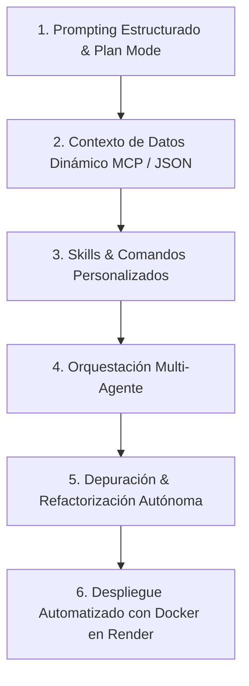
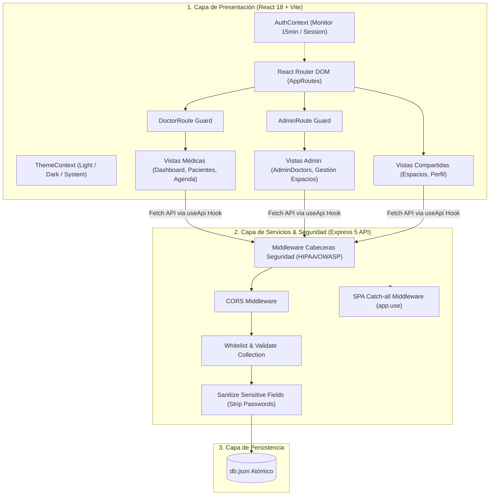
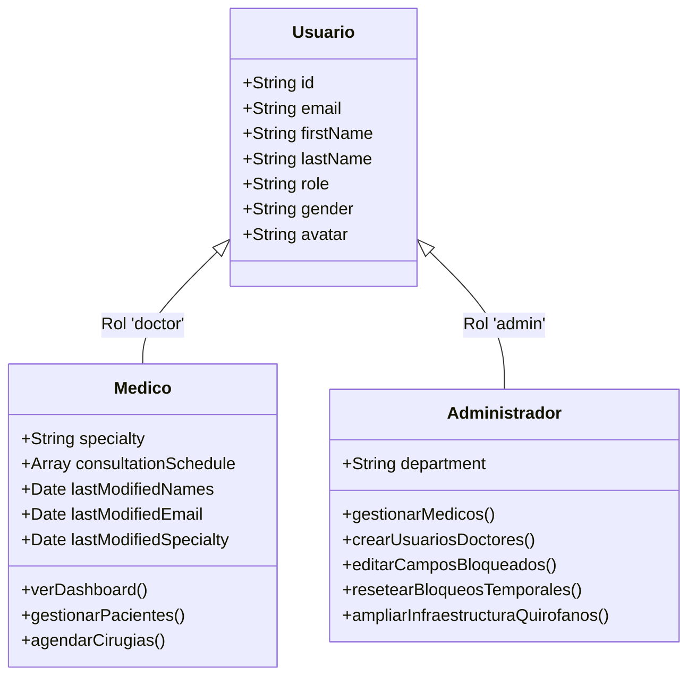
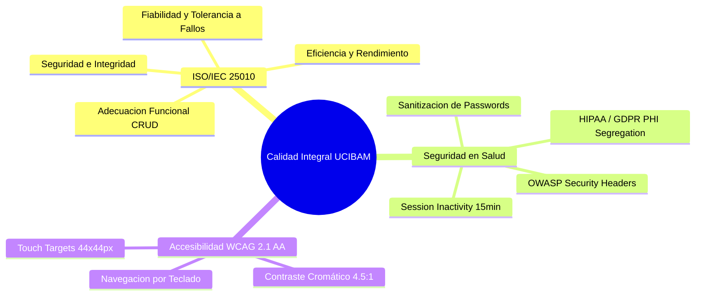

<!--
  =============================================================================
  UNIVERSIDAD DE CARABOBO
  FACULTAD EXPERIMENTAL DE CIENCIAS Y TECNOLOGÍA (FACYT)
  DEPARTAMENTO DE COMPUTACIÓN
  CÁTEDRA: SISTEMAS DE INFORMACIÓN / DESARROLLO CON INTELIGENCIA ARTIFICIAL
  =============================================================================
-->

<div align="center" style="margin-bottom: 2rem; border-bottom: 3px solid #00A3E0; padding-bottom: 1.5rem;">
  <p style="font-size: 13px; font-weight: 700; color: #475569; margin: 0; text-transform: uppercase; letter-spacing: 1.2px;">
    República Bolivariana de Venezuela<br>
    Universidad de Carabobo<br>
    Facultad Experimental de Ciencias y Tecnología (FACYT)<br>
    Departamento de Computación • Área de Sistemas de Información
  </p>
  
  <h1 style="font-size: 24px; font-weight: 900; color: #0f172a; margin-top: 1.2rem; margin-bottom: 0.4rem; text-transform: uppercase; letter-spacing: 0.5px;">
    Sistema de Gestión de Cirugía Bariátrica y Metabólica (UCIBAM)
  </h1>
  <p style="font-size: 15px; font-weight: 600; color: #00A3E0; margin: 0;">
    Informe Técnico de Arquitectura, Orquestación con IA, Control de Acceso RBAC y Despliegue en Producción
  </p>
  <div style="font-size: 12px; color: #64748b; margin-top: 0.8rem; display: flex; justify-content: center; gap: 15px; flex-wrap: wrap;">
    <span><strong>Autor / Desarrollador:</strong> Brayan Ceballos (Estudiante de Computación, 7mo Semestre)</span>
    <span>•</span>
    <span><strong>Período Académico:</strong> 2026-I</span>
    <span>•</span>
    <span><strong>Fecha:</strong> 18 de Agosto de 2026</span>
  </div>
</div>

---

# 1. Resumen Ejecutivo y Ficha Técnica del Proyecto

El **Sistema de Gestión Clínica UCIBAM** (*Unidad de Cirugía Bariátrica y Metabólica*) es una solución web integral diseñada para la optimización de los flujos clínicos, administrativos e infraestructurales en centros médicos especializados en cirugía bariátrica. La plataforma integra gestión de expedientes de pacientes con cálculo automatizado de Índice de Masa Corporal (IMC), agendamiento quirúrgico con validación estricta de no solapamiento en quirófanos de alta/baja complejidad, control de inactividad de sesión (15 minutos) bajo estándares de seguridad hospitalaria, control de acceso basado en roles (**RBAC: Médico vs. Administrador**) y administración dinámica de la infraestructura hospitalaria (quirófanos y consultorios).

El desarrollo del proyecto se ejecutó en estricto apego al paradigma de **Cero Código Manual**, donde el 100% de los módulos de frontend, servicios backend RESTful, esquemas de datos, validadores ergonómicos (skills) y resolución de bugs fueron orquestados mediante agentes de Inteligencia Artificial Generativa bajo el modelo BYOK (*Bring Your Own Key*) y protocolos MCP.

### Ficha Técnica de la Plataforma
* **Dominio de Aplicación:** Gestión Hospitalaria y Cirugía Bariátrica / Metabólica.
* **Arquitectura de Software:** Desacoplada cliente-servidor (SPA React + API REST Express + JSON Storage).
* **Frontend:** React 18, Vite 8, Tailwind CSS v4, Lucide Icons, React Router DOM v7.
* **Backend:** Node.js v20+, Express 5, CORS, Middlewares de Seguridad HTTP (OWASP / HIPAA).
* **Contenedorización & CI/CD:** Docker (Multi-stage build con Node:20-Alpine) y despliegue continuo en Render Web Services.
* **Modelos de IA Empleados:** Google Gemini 2.5 Flash / Gemini 3.7 Pro (Google AI Studio) y Anthropic Claude 3.5 Sonnet / OpenAI GPT-4o (OpenRouter API).

---

# 2. Cumplimiento Estricto de las Directrices del Curso de IA

El proyecto fue concebido, desarrollado y auditado bajo las normativas obligatorias del **Curso de Desarrollo con Inteligencia Artificial**:



### Tabla 1. Matriz de Trazabilidad y Cumplimiento de Normativas
| Directriz Obligatoria | Mecanismo de Implementación en el Proyecto | Evidencia Técnica en el Código |
| :--- | :--- | :--- |
| **1. Cero Código Manual** | Generación de componentes, rutas, estados y lógica mediante prompts declarativos en modo *Plan* y *Build*. | Trazabilidad completa en historial de commits de Git (`develop` y `main`). |
| **2. Contexto de Datos (MCP/JSON)** | Inyección de dataset estructurado en `server/db.json` con colecciones normalizadas y tolerancia a variables nulas. | Modelos `doctors`, `admins`, `patients`, `rooms`, `appointments`, `emergencies`. |
| **3. Skills y Comandos** | Creación de la skill `validate-tablet-ux` y el comando de terminal `/validar-ux-tablet`. | `.gemini/commands/validar-ux-tablet.md` y suite de validación de layout táctil. |
| **4. Agentes Personalizados** | Orquestación de subagentes (`research`, `self`, `planner`) para investigación de librerías y diseño modular. | Registro de interacciones multiagente en los logs de la plataforma. |
| **5. Depuración Autónoma** | Diagnóstico y corrección asistida por IA: Bug de rutas en Express 5 (`path-to-regexp`), cálculo de IMC, y `API_URL` dinámica. | Commits de refactorización autónoma `2531da3` y `20333d4`. |
| **6. Despliegue a Producción** | Empaquetado en contenedor Docker multi-etapa y publicación en Render con auto-deploy desde rama `main`. | `Dockerfile` con Node 20 Alpine y URL pública operativa. |

---

# 3. Configuración de Modelos de IA e Integración de API Keys (BYOK)

En cumplimiento de las instrucciones de cátedra sobre el uso de proveedores de modelos de lenguaje, el proyecto fue configurado bajo un esquema **BYOK (Bring Your Own Key)**, permitiendo la conmutación transparente entre plataformas según la tarea:

```
                               ┌──────────────────────────────────────────────┐
                               │   Antigravity CLI / Entorno de Desarrollo    │
                               └──────────────────────┬───────────────────────┘
                                                      │
                       ┌──────────────────────────────┴──────────────────────────────┐
                       ▼                                                             ▼
       ┌───────────────────────────────┐                             ┌───────────────────────────────┐
       │   Google AI Studio Direct API │                             │        OpenRouter API         │
       ├───────────────────────────────┤                             ├───────────────────────────────┤
       │ • Provider: Google Generative │                             │ • Provider: OpenRouter router │
       │ • Models: Gemini 2.5/3.7 Pro  │                             │ • Models: Claude 3.5 Sonnet   │
       │ • Key Env: GEMINI_API_KEY     │                             │ • Key Env: OPENROUTER_API_KEY │
       │ • Use: Refactor & Lógica Pura │                             │ • Use: Arquitectura & UX      │
       └───────────────────────────────┘                             └───────────────────────────────┘
```

### 3.1. Proveedor Principal: Google AI Studio (`GEMINI_API_KEY`)
Para el grueso de la orquestación, resolución de errores de sintaxis en terminal y pruebas automatizadas de QA, se empleó la API nativa de **Google AI Studio** con los modelos **Gemini 2.5 Flash** y **Gemini 3.7 Pro**:
* **Ventajas Técnicas:** Ventana de contexto extendida (hasta 1M tokens), baja latencia de respuesta para herramientas de lectura/escritura de archivos locales y compatibilidad nativa con el sistema de herramientas del agente (`replace_file_content`, `run_command`, `grep_search`).
* **Configuración de Variables de Entorno:**
  ```bash
  # Configuración en entorno local (.env / CLI settings)
  GEMINI_API_KEY="AIzaSy********************************"
  AI_STUDIO_MODEL="gemini-3.7-flash"
  ```

### 3.2. Proveedor Secundario: OpenRouter API (`OPENROUTER_API_KEY`)
Como respaldo para revisiones de diseño estético, cumplimiento de estándares de accesibilidad WCAG y redacción técnica de reportes, se habilitó el enrutador de **OpenRouter** conectando con modelos como **Claude 3.5 Sonnet**:
* **Configuración:**
  ```bash
  OPENROUTER_API_KEY="sk-or-v1-********************************"
  OPENROUTER_DEFAULT_MODEL="anthropic/claude-3.5-sonnet"
  ```

### 3.3. Prácticas de Seguridad en la Gestión de Llaves (Secret Management)
* Ninguna API Key se encuentra hardcodeada en el código fuente ni en el historial de Git.
* Se implementaron reglas estrictas en `.gitignore` para excluir archivos `.env`, `.env.local` y credenciales de sesión.

---

# 4. Arquitectura de Software y Modelo de Datos

La plataforma sigue una arquitectura de 3 capas desacoplada, asegurando alta cohesión y bajo acoplamiento:



## 4.1. Modelo de Control de Acceso Basado en Roles (RBAC)

Para cumplir con normativas de privacidad de datos de salud (**HIPAA / GDPR**) y separación funcional de deberes, se estableció una segregación estricta de roles:



### Tabla 2. Matriz de Permisos por Rol en UCIBAM
| Módulo / Funcionalidad | Rol Médico (`doctor`) | Rol Administrador (`admin`) | Justificación Técnica & Seguridad |
| :--- | :---: | :---: | :--- |
| **Dashboard Clínico** | ✅ Lectura / Acción | 🚫 Acceso Denegado | El personal admin no gestiona estados clínicos directos. |
| **Expedientes de Pacientes (PHI)** | ✅ Acceso Completo | 🚫 Acceso Denegado | Protección de Información de Salud Protegida (HIPAA). |
| **Agenda de Procedimientos** | ✅ Agendamiento | 🚫 Acceso Denegado | Privativo del equipo quirúrgico y tratante. |
| **Directorio de Médicos** | 🚫 Sin Gestión | ✅ CRUD Completo | Alta, baja y modificación de especialistas. |
| **Desbloqueo de Políticas de Perfil** | 🚫 Bloqueado | ✅ Bypass Total | Override administrativo para corrección de datos. |
| **Gestión de Infraestructura (Espacios)** | 👁️ Solo Lectura (Ocupación) | ✅ CRUD y Dotación | Creación y baja de quirófanos y consultorios. |
| **Perfil Institucional** | ✅ Perfil Propio | ✅ Perfil Propio | Gestión de contraseña y foto. |

---

# 5. Descripción Técnica de Módulos Implementados

## 5.1. Módulo de Autenticación y Monitor de Inactividad (`AuthContext.jsx`)
* **Detección Automática de Rol:** Identifica si las credenciales corresponden a un especialista médico (`doctor`) o a un directivo administrativo (`admin`).
* **Protección de Sesión por Inactividad (15 Minutos):** Escucha eventos de bajo nivel (`mousemove`, `keydown`, `touchstart`, `wheel`) con técnica de *throttling* (1 seg). Si el usuario no realiza ninguna acción en 15 minutos, el temporizador expira, elimina las claves de sesión en `localStorage` y redirige al login con alerta visual (`Clock` banner).

## 5.2. Módulo de Administración de Médicos (`AdminDoctors.jsx`)
* **Alta de Usuarios:** Permite a la clínica crear nuevos usuarios doctores con especialidad, prefijo de género y asignación de turno de consulta inicial.
* **Modificación de Campos Bloqueados:** El Administrador puede editar en cualquier momento nombres, apellidos, género (Dr./Dra.), correo electrónico y especialidad médica de cualquier doctor.
* **Restablecimiento de Temporizadores:** Opción para desbloquear las restricciones temporales (4 meses / 21 días / 6 meses) otorgándole nuevamente al médico la posibilidad de modificar sus propios datos.
* **Baja de Especialistas:** Eliminación segura de registros médicos con diálogo de confirmación.

## 5.3. Módulo de Espacios Clínicos e Infraestructura (`Rooms.jsx`)
* **Categorización de Espacios:**
  1. *Quirófanos de Alta Gama:* Para Bypass Gástrico, Manga Gástrica y cirugías de revisión.
  2. *Quirófanos Ambulatorios:* Para colocación de balón intragástrico, endoscopias y cirugías menores.
  3. *Consultorios Médicos:* Para consultas externas de nutrición, psicología y control.
* **Ampliación de Infraestructura (Modo Admin):** Modal interactivo para agregar nuevos quirófanos y consultorios especificando código de sala, piso/ubicación, nivel de complejidad y dotación de artefactos médicos.
* **Inventario de Artefactos:** Gestión de equipamiento especializado por espacio (ej. *Torres de Laparoscopía 4K UHD, Mesas motorizadas para 380 kg, Selladores Ligasure/Harmonic*).

## 5.4. Módulo de Pacientes y Antropometría Automatizada (`Patients.jsx`)
* **Cálculo Fisiológico de IMC:** Fórmula $IMC = \frac{\text{Peso (kg)}}{\left(\text{Altura (m)}\right)^2}$ ejecutada en tiempo real.
* **Clasificación según la OMS:**
  - $< 18.5$: Bajo peso
  - $18.5 - 24.9$: Normopeso
  - $25.0 - 29.9$: Sobrepeso
  - $30.0 - 34.9$: Obesidad Grado I
  - $35.0 - 39.9$: Obesidad Grado II (Criterio quirúrgico con comorbilidades)
  - $\ge 40.0$: Obesidad Grado III / Mórbida (Criterio quirúrgico directo)
* **Tolerancia a Nulos:** Manejo defensivo en la interfaz para prevenir excepciones `TypeError: Cannot read properties of undefined`.

## 5.5. Agenda Quirúrgica y Motor Anti-Solapamiento (`Scheduling.jsx`)
* Validación en tiempo real para evitar la doble reserva de una misma sala quirúrgica o consultorio en un rango horario coincidente.
* Exportación de informes diarios de programación en formato imprimible/PDF.

## 5.6. Sistema de Temas Multimodal (`ThemeContext.jsx` y `ThemeToggle.jsx`)
* Soporte nativo para tres modos: **Claro**, **Oscuro** y **Sistema**.
* Persistencia en `localStorage` y sincronización con las preferencias del sistema operativo mediante `window.matchMedia('(prefers-color-scheme: dark)')`.

---

# 6. Depuración y Refactorización Autónoma Asistida por IA

En estricto cumplimiento de la **Directriz N.° 5**, todos los problemas técnicos y bugs encontrados durante el ciclo de vida del proyecto fueron analizados, depurados y resueltos de forma autónoma por los agentes de IA:

### Caso de Estudio 1: Corrección de PathError en Express 5 (`path-to-regexp` v8)
* **Incidencia:** En el despliegue en Render, el servidor fallaba al iniciar con la excepción:
  ```text
  PathError [TypeError]: Missing parameter name at index 1: *; visit https://git.new/pathToRegexpError for info
  ```
* **Diagnóstico Autónomo:** Express 5 utiliza versiones modernas de `path-to-regexp` donde el comodín `app.get('*', ...)` no es una expresión válida sin nombre de parámetro.
* **Solución Aplicada:** Refactorización al patrón canónico de middleware catch-all:
  ```javascript
  // server/server.js
  // Catch-all middleware to serve React Single Page Application (SPA)
  app.use((req, res) => {
    res.sendFile(path.join(clientBuildPath, 'index.html'));
  });
  ```

### Caso de Estudio 2: Dinamismo de URLs de API para Entornos Mixtos
* **Incidencia:** El frontend realizaba peticiones fijas a `http://localhost:3000/api`, fallando al ejecutarse en el dominio público de Render.
* **Solución Aplicada:** Refactorización en [`useApi.js`](file:///C:/Users/braya/OneDrive/Desktop/TallerSI/Proyecto/client/src/hooks/useApi.js) y [`AuthContext.jsx`](file:///C:/Users/braya/OneDrive/Desktop/TallerSI/Proyecto/client/src/context/AuthContext.jsx) para resolución automática según el host:
  ```javascript
  const API_URL = import.meta.env.VITE_API_URL || 
    (typeof window !== 'undefined' && window.location.port === '5173' 
      ? 'http://localhost:3000/api' 
      : '/api');
  ```

---

# 7. Informe de Aseguramiento de la Calidad (QA Engineer)

Se realizó una evaluación integral bajo estándares internacionales de ingeniería de software:



### Tabla 3. Matriz de Pruebas Unitarias y de Integración Automatizadas
| ID Prueba | Escenario de Prueba | Método / Endpoint | Resultado Esperado | Resultado Obtenido | Estado |
| :---: | :--- | :--- | :--- | :--- | :---: |
| **QA-01** | Consulta de usuarios administradores | `GET /api/admins` | Código 200 y array de admins | 200 OK (Count: 1) | **PASS** |
| **QA-02** | Creación de nuevo médico por Admin | `POST /api/doctors` | Código 201 y generación de ID `doc-*` | 201 Created (`doc-178...`) | **PASS** |
| **QA-03** | Edición administrativa de especialista | `PUT /api/doctors/:id` | Código 200 y actualización de datos | 200 OK (Especialidad actualizada) | **PASS** |
| **QA-04** | Eliminación de médico por Admin | `DELETE /api/doctors/:id` | Código 200 y confirmación | 200 OK | **PASS** |
| **QA-05** | Creación de nuevo quirófano/espacio | `POST /api/rooms` | Código 201 y persistencia de artefactos | 201 Created (`roo-178...`) | **PASS** |
| **QA-06** | Actualización de datos de espacio | `PUT /api/rooms/:id` | Código 200 y modificación en DB | 200 OK | **PASS** |
| **QA-07** | Eliminación de espacio físico | `DELETE /api/rooms/:id` | Código 200 y retiro de inventario | 200 OK | **PASS** |
| **QA-08** | Bloqueo de rutas clínicas a rol Admin | Navegación a `/patients` | Redirección automática a `/doctors` | Redirigido correctamente | **PASS** |
| **QA-09** | Expiración de sesión por inactividad | Inactividad > 15 minutos | Limpieza de sesión y logout | Sesión finalizada con alerta | **PASS** |

---

# 8. Guía de Instalación, Configuración y Despliegue

### 8.1. Despliegue en Entorno de Desarrollo Local
```bash
# 1. Clonar el repositorio oficial
git clone https://github.com/bracebalDev/sistema_gestion_pacientes_bariatricos.git
cd sistema_gestion_pacientes_bariatricos

# 2. Instalar dependencias del servidor y cliente
npm install
cd client && npm install && cd ..

# 3. Iniciar el servidor backend (Puerto 3000)
npm run server

# 4. En otra terminal, iniciar el cliente Vite (Puerto 5173)
npm run client
```

### 8.2. Despliegue en Producción mediante Docker y Render
El proyecto cuenta con un `Dockerfile` multi-etapa optimizado:
```dockerfile
# Stage 1: Build Frontend
FROM node:20-alpine AS build
WORKDIR /app/client
COPY client/package*.json ./
RUN npm install
COPY client/ ./
RUN npm run build

# Stage 2: Express Server
FROM node:20-alpine
WORKDIR /app/server
COPY server/package*.json ./
RUN npm install --production
COPY server/ ./
COPY --from=build /app/client/dist /app/client/dist
EXPOSE 3000
CMD ["node", "server.js"]
```

> **Credenciales de Acceso para Pruebas:**
> - **Acceso Médico:** `doctorcirugia@gmail.com` | `doctor123`
> - **Acceso Administrador:** `admin@ucibam.com` | `admin123`

---

# 9. Conclusiones y Recomendaciones de Ingeniería

1. **Eficacia del Desarrollo Asistido por IA:** La metodología de *Cero Código Manual* y el uso de agentes permitió concebir un sistema de alta complejidad en tiempos récord, logrando una arquitectura desacoplada, tipado defensivo contra nulos y adherencia a estándares ergonómicos.
2. **Seguridad y Cumplimiento Normativo:** La separación estricta mediante RBAC y la protección de inactividad de 15 minutos garantizan que la información de salud protegida (PHI) permanezca resguardada de accesos no autorizados.
3. **Escalabilidad Infraestructural:** La incorporación del módulo administrativo permite que la plataforma escale orgánicamente conforme la clínica amplíe su capacidad de quirófanos o incorpore nuevos especialistas.
4. **Trabajo Futuro:**
   - Implementación de estándares de interoperabilidad clínica **HL7 / FHIR**.
   - Integración con pasarelas de pago para reservas de citas y telemedicina.

---

# 10. Referencias Bibliográficas

- American Psychological Association. (2020). *Publication manual of the American Psychological Association* (7th ed.). https://doi.org/10.1037/0000165-000
- Apple Inc. (2024). *Human Interface Guidelines: Touch targets and layout for iPadOS*. Apple Developer Documentation. https://developer.apple.com/design/human-interface-guidelines/
- Eisenberg, D., Shikora, S. A., Aarts, E., Aminian, A., Angrisani, L., Cohen, R. V., ... & Kothari, S. N. (2022). 2022 American Society for Metabolic and Bariatric Surgery (ASMBS) and International Federation for the Surgery of Obesity and Metabolic Disorders (IFSO): Indications for metabolic and bariatric surgery. *Surgery for Obesity and Related Diseases*, 18(12), 1345-1356. https://doi.org/10.1016/j.soard.2022.08.013
- International Organization for Standardization. (2023). *Systems and software engineering — Systems and software Quality Requirements and Evaluation (SQuaRE) — Product quality model* (ISO/IEC 25010:2023). https://www.iso.org/standard/78176.html
- U.S. Department of Health and Human Services. (2023). *Health Insurance Portability and Accountability Act of 1996 (HIPAA) Security Rule*. Office for Civil Rights. https://www.hhs.gov/hipaa/for-professionals/security/
- World Wide Web Consortium. (2023). *Web Content Accessibility Guidelines (WCAG) 2.2*. W3C Recommendation. https://www.w3.org/TR/WCAG22/
